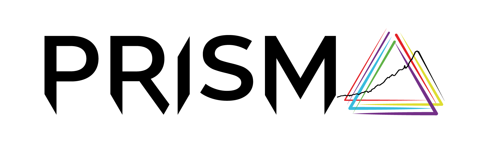

<p align="center">
  <picture>
    <source
        media="(prefers-color-scheme: dark)"
        srcset="docs/assets/logos/logo-dark.svg"
    >
    <source
        media="(prefers-color-scheme: light)"
        srcset="docs/assets/logos/logo-light.svg"
    >
    
  </picture>
</p>


# Scenario Validation Criteria

Validation criteria for scenarios produced by Integrated Assessment
Models (IAMs), energy system models and similar tools.

---

## Background

IAMs are computational models that produce scenarios of economy, energy
system, land use, and greenhouse-gas emissions developments over time, across
regions, and under different policy assumptions. Large ensembles of such
scenarios by multiple model families underpin major scientific assessments
such as the IPCC reports.

Scenarios are often validated in the process of producing new scenarios or
when in the process of collecting and assess existing scenario ensembles.
Specifically, scenarios are often checked against empirical observations,
near-term projections, and sustainability targets to identify scenarios that
are outdated, internally inconsistent, technically infeasible, or ecologically
undesirable. This package provides a versioned, machine-readable set of such
validation criteria so that different research groups can apply the same
standards.

---

## Repository structure

The core data lives in `inst/extdata/`:

```
inst/extdata/
├── criteria-types.yaml          # Definitions of criterion types
├── sources.bib                  # Bibliographic references
├── criteria/
│   ├── [criteria type]/         # Label of a criteria type
│   │   ├── thresholds.csv       # Threshold values (variable, region, year, bounds)
│   │   └── metadata.yaml        # Justifications for criteria and thresholds
│   └── […]                      # More criteria types
└── reference-data/
    └── *.csv                    # External datasets used as threshold references
```

---

## Citation

If you use this package in your research, please cite it using the metadata in
[`CITATION.cff`](CITATION.cff).

---

## License

All data and code are published under the [MIT licence](LICENSE.md).

---

## Acknowledgments
This collection of scenario validation criteria was curated as part of the 
[Scenario Compass Initiative (SCI)](https://scenariocompass.org). Some of 
the reference data was previously derived in the 
[PRISMA](https://www.net0prisma.eu/) project.

SCI is supported financially by the Bezos Earth Fund. PRISMA has received 
funding from the European Union’s Horizon Europe research and innovation 
programme under grant agreement No. 101081604 (PRISMA).

<p align="center">
  <picture>
    <source
        media="(prefers-color-scheme: dark)"
        srcset="docs/assets/logos/sci-dark.svg"
    >
    <source
        media="(prefers-color-scheme: light)"
        srcset="docs/assets/logos/sci-light.svg"
    >
    
  </picture>
  <picture>
    <source
        media="(prefers-color-scheme: dark)"
        srcset="docs/assets/logos/prisma-dark.png"
    >
    <source
        media="(prefers-color-scheme: light)"
        srcset="docs/assets/logos/prisma-light.png"
    >
    
  </picture>
</p>
