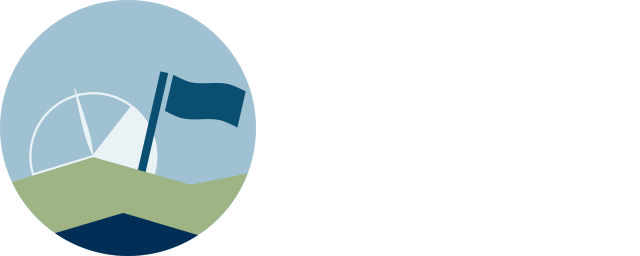
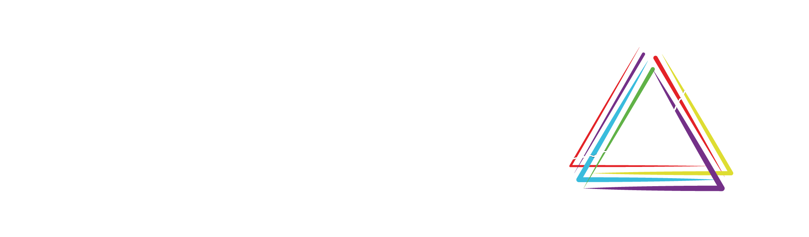

---
hide:
  - navigation
  - toc
---

<p align="center">
  
  
</p>


<h1 style="position: absolute; width: 1px; height: 1px; padding: 0; margin: -1px; overflow: hidden; clip: rect(0, 0, 0, 0); white-space: nowrap; border: 0;">Scenario Validation Criteria</h1>

{{ readme_section('## Background') }}

<div class="grid cards" markdown>

-   :octicons-info-24:{ .lg .middle } __Summary__

    ---

    Look at the summary page of the criteria definitions.

    [:octicons-arrow-right-24: See summary](summary/)

-   :octicons-three-bars-24:{ .lg .middle } __Components__

    ---

    Look at the individual components defining the criteria.

    [:octicons-arrow-right-24: See components](components/)

-   :octicons-code-24:{ .lg .middle } __Tutorials__

    ---

    Look at R and Python tutorials for loading and applying the criteria.

    [:octicons-arrow-right-24: See tutorials](tutorials/)

</div>

---

## Citation

Please cite as:

```python exec="true" session="index" showcode="false"
from pathlib import Path

import yaml

cff = yaml.safe_load(Path("CITATION.cff").read_text())


def _format_author(author):
    given = author.get("given-names", "").split()
    initials = " ".join(f"{part[0]}." for part in given if part)
    family = author.get("family-names", "")
    return f"{family}, {initials}".strip().rstrip(",")


authors = [_format_author(a) for a in cff["authors"]]
if len(authors) > 1:
    author_str = ", ".join(authors[:-1]) + ", & " + authors[-1]
else:
    author_str = authors[0]

year = str(cff["date-released"]).split("-")[0]
title = cff["title"]
version = cff["version"]
url = "https://github.com/IAMconsortium/scenario-validation-criteria/"

print(
    f"> {author_str} ({year}). *{title}* "
    f"(Version {version}) [Computer software]. {url}"
)
```

---

## License

All data and code are published under the [MIT licence](https://github.com/IAMconsortium/scenario-validation-criteria/blob/main/LICENSE.md).

---

{{ readme_section('## Acknowledgments') }}

<p align="center">
  
  
  
  
</p>
